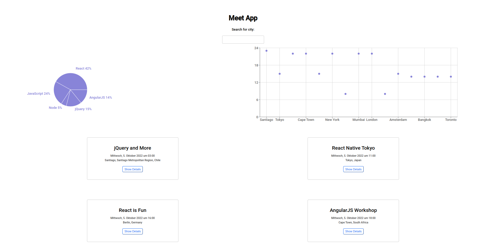

# meet

This app  will provide access to a list of events for searchable cities. The info provided will include time, location as well as a chart for info on all events in a specific city.

This is a serverless, progressive web application (PWA) with React using a
test-driven development (TDD) technique. The application uses the Google
Calendar API to fetch upcoming events.

# Technologies used
- React

# User stories and scenarios

## FEATURE 1: FILTER EVENTS BY CITY

As a user
I should be able to “filter events by city”
So that I can see the list of events that take place in that city

* __Scenario 1: When user hasn' searched for a city, show upcoming events from all cities__ 
Given user hasn’t searched for any city 
When the user opens the app 
Then the user should see a list of all upcoming events 

* __Scenario 2: User should see a list of suggestions when they search for a city__ 
Given the main page is open 
When user starts typing in the city textbox 
Then the user should see a list of cities (suggestions) that match what they’ve typed 

* __Scenario 3: User can select a city from the suggested list__ 
Given the user was typing “Berlin” in the city textbox 
And the list of suggested cities is showing 
When the user selects a city (e.g., “Berlin, Germany”) from the list 
Then their city should be changed to that city (i.e., “Berlin, Germany”) 
And the user should receive a list of upcoming events in that city 

## FEATURE 2: SHOW/HIDE AN EVENT'S DETAILS

As a user,
I should be able to expand an event element by clicking on it,
So that I can see further details of the event.

* __Scenario 1: Collapsed by Default__ 
Given the event list is loaded 
When the user hasn’t clicked anything yet 
Then the event will be collapsed 

* __Scenario 2: Expanding the details__ 
Given the event element is collapsed 
When the user clicks an event 
Then the event will expand, revealing further info 

* __Scenario 3: Collapse the details__ 
Given the event element is expanded 
When the user again clicks the event 
Then the event will collapse again, hiding further info on the event 

## FEATURE 3: SPECIFY NUMBER OF EVENTS

As a user,
I should be able to type in a number to specify the number of events shown,
So that I can only see as many events as I have specified.

* __Scenario 1: No Number is specified__ 
Given the no number of events to be shown has been specified 
When the user starts a search 
Then the default amount (32) of events will be listed 

* __Scenario 2: User has specified event count preference__ 
Given the event list is loaded 
When the user specifies a number of events shown 
Then the list of events will be as long as the user specified (or less, if less events are available) 

## FEATURE 4: USE THE APP WHEN OFFLINE

As a user,
I should be able use basic app functions offline,
So that I can still use the app's basic features (i.e. showing events), despite having a live internet connection.

* __Scenario 1: Show cached data when offline__ 
Given the connection to the internet has been lost 
When the user uses the app 
Then the app will use a cached version of the information to be shown 

* __Scenario 2: Show error if user tried to change location__ 
Given the connection to the internet has been lost 
When the user changes settings (i.e. city or time range) 
Then the app will show an error message 

## FEATURE 5: DATA VISUALIZATION

As a user,
I should be able to select a specific city to open up data visualization about its upcoming events,
So that I can see organized  statistics about the events in that specific city.

* __Scenario 1: Show chart with number of events__ 
Given the a search for a city has been started 
When the user clicks on a city’s name 
Then the more info on upcoming events for that city will be displayed 

# Getting Started

To get started with the meet App follow these steps.

## Prerequisites

Your system should have a NPM.

- npm

  `npm install npm@latest -g`

## Installation

Required installation to get started with the App, follow these steps.

Clone the repo

`git clone https://github.com/carnivalgoblin/meet.git`

Install NPM packages

`npm install`

Start the app

`npm run start`

To push changes to github pages

`npm run deploy`
